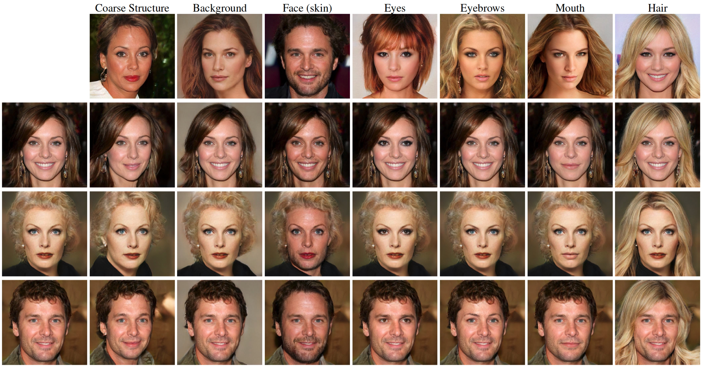
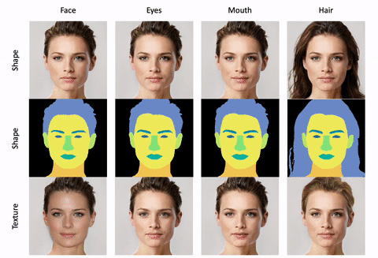

# SemanticStyleGAN: Learning Compositional Generative Priors for Controllable Image Synthesis and Editing (CVPR 2022)

> Yichun Shi, Xiao Yang, Yangyue Wan, Xiaohui Shen
> 
> Recent studies have shown that StyleGANs provide promising prior models for downstream tasks on image synthesis and editing. However, since the latent codes of StyleGANs are designed to control global styles, it is hard to achieve a fine-grained control over synthesized images. We present SemanticStyleGAN, where a generator is trained to model local semantic parts separately and synthesizes images in a compositional way. The structure and texture of different local parts are controlled by corresponding latent codes. Experimental results demonstrate that our model provides a strong disentanglement between different spatial areas. When combined with editing methods designed for StyleGANs, it can achieve a more fine-grained control to edit synthesized or real images. The model can also be extended to other domains via transfer learning. Thus, as a generic prior model with built-in disentanglement, it could facilitate the development of GAN-based applications and enable more potential downstream tasks.

<a href="https://arxiv.org/abs/2112.02236"></a>
<a href="https://creativecommons.org/licenses/by/4.0"></a>  

<a href="https://www.youtube.com/watch?v=nfKiVX4pFlw"></a>  


<p align="center">
  
<br>
SemanticStyleGAN factorizes its latent space based on semantic regions. Here, we show the results of style mixing by swapping
local latent codes.
</p>

# Description   
Official Implementation of our SemanticStyleGAN paper for training and inference. 

# Table of Contents
- [Installation](#installation)
- [Pretrained Models](#pretrained-models)
- [Inference](#inference)
  * [Synthesis](#synthesis)
  * [Inversion](#inversion)
  * [Computing Metrics](#computing-metrics)
- [Training](#training)
  * [Data Preparation](#data-preparation)
  * [Training SemanticStyleGAN](#training-semanticstylegan)
  * [Domain Adaptation](#domain-adaptation)
- [Credits](#credits)
- [Acknowledgments](#acknowledgments)
- [Citation](#citation)

# Installation
- Python 3
- Pytorch 1.8+
- Run `pip install -r requirements.txt` to install additional dependencies.

<br>

# Pretrained Models

In this repository, we provide pretrained models for various domains.  
(TODO: Add model URLs)

| Path | Description
| :--- | :----------
|[CelebAMask-HQ]()  | Trained on the [CelebAMask-HQ](https://github.com/switchablenorms/CelebAMask-HQ) dataset.
|[BitMoji]()  | Fine-tuned on the re-cropped [BitMoji](https://www.kaggle.com/datasets/mostafamozafari/bitmoji-faces) dataset.
|[MetFaces]()  | Fine-tuned on the [MetFaces](https://github.com/NVlabs/metfaces-dataset) dataset.
|[Toonify]()  | Fine-tuned on the [Tonnify](https://github.com/justinpinkney/toonify) dataset.

<br>

# Inference

## Synthesis
### Random Synthesis
In `visualize/generate.py`, we provide a script for sampling random images and their corresponding segmentation masks with SemanticStyleGAN.
An example command is provided below:
```
python visualize/generate.py \
/path/to/checkpoint \
--outdir results/samples \
--sample 20 \
--save_latent
```
The `save_latent` flag will save the w latent code of each synthesized image in a separate `.npy` file.

### Local Latent Interpolation
  

In `visualize/generate_video.py`, we provide a script for visualizing the local interpolation by SemanticStyleGAN.
An example command is provided below:  
```
python visualize/generate_video.py \
/path/to/checkpoint \
--outdir /results/interpolation \
--latent /results/samples/000000_latent.npy
```
Here, `/results/samples/000000_latent.npy` is the latent code either generated by `visualize/generate.py` or output by `visualize/invert.py`. You can also ignore the `--latent` flag for 
generating a video with a random latent code. The scripts will create sevaral mp4 files udner the output folder, each shows the interpolation animation in
a specific latent subspace.

### Synthesizing Components
In `visualize/generate_components.py`, we provide a script for visualizing the components synthesized by SemanticStyleGAN, where we will gradually add more local generators
to the synthesis procedure.
An example command is provided below:
```
python visualize/generate_components.py \
/path/to/checkpoint \
--outdir /results/components \
```
This command will synthesize random images in a gradual manner. You can also visualize the components of a specific target image with the following command:
```
python visualize/generate_components.py \
/path/to/checkpoint \
--outdir /results/components/000000 \
--latent /results/samples/000000_latent.npy \
```

## Computing Metrics
Given a trained generator and a prepared inception file, we can compute the metrics with following command:
```
python calc_fid.py \
--ckpt /path/to/checkpoint \
--inception /path/to/inception/file 
```

## Inversion
### Optimization-based
You can use `visualize/invert.py` for inverting real images into the latent space of SemanticStyleGAN via optimization:
```
python visualize/invert.py \
--ckpt /path/to/checkpoint \
--imgdir /path/to/img/directory/ \
--outdir /path/to/output/directory/ \
--size 512 \
```
This script will save the reconstructed images and their corresponding w-plus latent codes in separate sub-directories under the `outdir`. Additionally, you can set `--finetune_step` to a non-zero integer for pivotal tuning inversion.

### Encoder
TODO

<br>

# Training

## Data Preparation
1. In our work, we use re-mapped segmentation labels of CelebAMask-HQ. To reproduce this dataset, first download the original CelebAMask-HQ dataset from [here](https://drive.google.com/file/d/1badu11NqxGf6qM3PTTooQDJvQbejgbTv/view) and uncompress it to `data/CelebAMask-HQ`. Then, run the following command to create the images and labels used for training:
```
python data/preprocess_celeba.py data/CelebAMask-HQ
```
The script will create four folders under the `data/CelebAMask-HQ` that contain the images and labels for training and testing, respectively.

2. Similar to rosinality's implementation of StyleGAN2, we use LMDB datasets for training. An example command is provided below:
```
python prepare_mask_data.py
data/CelebAMask-HQ/image_train \
data/CelebAMask-HQ/label_train \
--out data/lmdb_celebamaskhq_512 \
--size 512
```
You can also use your own dataset for the step. Note that the mask labels and image files are matched according to file names. It is okay if the files are under sub-directories. But make sure the base names are unique.

3. Prepare the inception file for calculating FID:
```
python prepare_inception.py
data/lmdb_celebamaskhq_512
--output data/cache_celebamaskhq_512 \
--size 512
--dataset_type mask
```

## Training SemanticStyleGAN
The main training script can be found in `train.py`. Here, we provide an example for training on the CelebAMask-HQ that we prepared above :
```
python train.py \
--dataset data/lmdb_celebamaskhq_512 \
--checkpoint_dir checkpoint/celebamaskhq_512 \
--seg_dim 13 \
--size 512 \
--transparent_dims 10 12 \
--residual_refine \
--batch 16 \
```
or you can use the following command for multi-gpu training (we assume 8 gpus are available):
```
python -m torch.distributed.launch --nproc_per_node=8 \
train.py \
--dataset data/lmdb_celebamaskhq_512 \
--checkpoint_dir checkpoint/celebamaskhq_512 \
--seg_dim 13 \
--size 512 \
--transparent_dims 10 12 \
--residual_refine \
--batch 4 \
```
Here, `--seg_dim` refers to the number of segmentation classes (including background). `--transparent_dims` specifies the classes that are treated to be possibly transparent. 

If you want to restore from an intermediate checkpoint, simply add the flag `--ckpt /path/to/chekcpoint/file` where the checkpoint file is a .pt file saved by our training script.

Additionally, if you have tensorboard installed, you can visualize tensorboard logs in the `checkpoint_dir`.

<br>

## Domain Adaptation

In `train_adaptation.py`, we provide a script for performing domain adaptation on image-only datasets.
To do this, you first need to create an LMDB for the target image dataset.
A example command is provided below: 
```
python prepare_image_data.py \
data/metfaces/images \
--size 512 \
--out data/lmdb_metfaces_512
``` 
Then, you can run the following command for fine-tuning on the target dataset:
```
python -m torch.distributed.launch --nproc_per_node=8 \
train_adaptation.py \
--dataset data/lmdb_metfaces_512 \
--checkpoint_dir checkpoint/metfaces \
--seg_dim 13 \
--size 512 \
--transparent_dims 10 12 \
--residual_refine \
--batch 4 \
--freeze_local
```
The `--freeze_local` flag will freeze the local generators during training, which preserves the spatial disentanglement. However, for datasets that has a large geometric difference from the real faces (e.g. BitMoji), you may want to remove this argument. In fact, we found that our model is still able to preserve the disentanglement within a few thousand steps of fine-tuning all modules.

Note that the dataloader for adaptation is compatiable with rosinality's implementation, so you can use the same LMDB datasets for fine-tuning SemanticStyleGAN. By default we fine-tune the model for 2000 steps, but you may want to look at the visualization samples for early stopping.

<br>

# Credits
**StyleGAN2 model and implementation:**  
https://github.com/rosinality/stylegan2-pytorch  
Copyright (c) 2019 Kim Seonghyeon  
License (MIT) https://github.com/rosinality/stylegan2-pytorch/blob/master/LICENSE  

**LPIPS model and implementation:**  
https://github.com/S-aiueo32/lpips-pytorch  
Copyright (c) 2020, Sou Uchida  
License (BSD 2-Clause) https://github.com/S-aiueo32/lpips-pytorch/blob/master/LICENSE  

**ReStyle model and implementation:**  
https://github.com/yuval-alaluf/restyle-encoder  
Copyright (c) 2021 Yuval Alaluf  
License (MIT) https://github.com/yuval-alaluf/restyle-encoder/blob/main/LICENSE  

**Please Note**: The CUDA files are made available under the [Nvidia Source Code License-NC](https://nvlabs.github.io/stylegan2/license.html)

# Acknowledgments
This code is initialy built from [SemanticGAN](https://github.com/eladrich/pixel2style2pixel).


# Citation
If you use this code for your research, please cite the following work:
```
@inproceedings{shi2021SemanticStyleGAN,
author    = {Shi, Yichun and Yang, Xiao and Wan, Yangyue and Shen, Xiaohui},
title     = {SemanticStyleGAN: Learning Compositional Generative Priors for Controllable Image Synthesis and Editing},
booktitle   = {CVPR},
year      = {2022},
}
```
